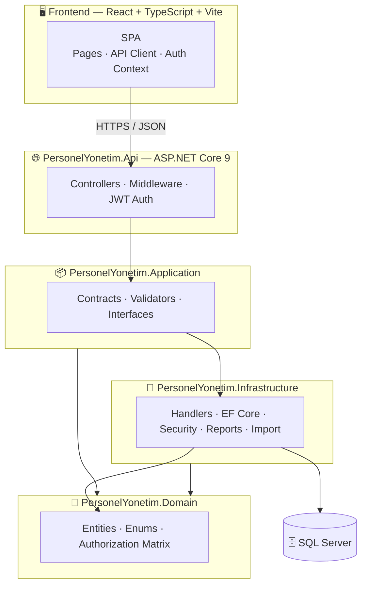

<div align="center">

# 🏛️ Personnel Information & Management System

*A secure, role-based HR & organizational management platform for public-sector personnel operations.*

<br/>

[](https://dotnet.microsoft.com/)
[](https://react.dev/)
[](https://www.typescriptlang.org/)
[](https://vitejs.dev/)
[](https://www.microsoft.com/sql-server)

[](#-architecture)
[](#-security)
[](#-continuous-integration)
[](#-license)

</div>

---

## 📌 Overview

The **Personnel Information & Management System (PIMS)** is a full-stack enterprise web application built to manage the complete personnel lifecycle of a municipal directorate. It covers employee records, organizational structure, assignments and movements, competencies, certifications, reporting, and data quality — all governed by a granular, permission-based access model.

The system is designed around **data protection by default**: sensitive fields such as national identity numbers are encrypted at rest, masked in the UI, and every privileged access is written to an immutable audit trail.

> **Domain hierarchy:** `Municipality → Deputy Presidency → Directorate → Main Unit → Sub Unit → Facility`

---

## ✨ Key Features

| Domain | Capabilities |
| --- | --- |
| 👤 **Employee Management** | Full CRUD, profile completion scoring, photo upload, status lifecycle (active / on-leave / left / archived) |
| 🏢 **Organization** | Interactive org chart, 6-level unit hierarchy, facility management, unit managers with actual-duty labels |
| 🔀 **Assignments & Movements** | Primary/secondary duty assignments, transfer & movement history tracking |
| 🎓 **Profile Records** | Education, skills/competencies, certifications with document attachments |
| 📊 **Reports** | Configurable report builder, Excel & PDF export with column-level permission gating |
| 📥 **Bulk Import** | Excel-based mass personnel import with template & validation |
| 🩺 **Data Quality** | Automated detection of missing/incomplete records (e.g. missing TCKN) |
| 🔔 **Notifications** | System notifications for reminders, expirations, and movements |
| 🔐 **IAM** | Users, roles, and a full permission matrix editor |
| 📜 **Audit Logs** | Immutable trail of sensitive-data access and authentication events |
| ⚙️ **Settings** | Application-level configuration catalog |

---

## 🏗️ Architecture

The backend follows **Clean Architecture** with strict dependency direction (outer layers depend on inner layers only).



### Project Layout

```
.
├── backend/
│   ├── PersonelYonetim.sln
│   └── src/
│       ├── PersonelYonetim.Domain/          💎 Entities, enums, authorization catalog
│       ├── PersonelYonetim.Application/      📦 Contracts, validators, interfaces
│       ├── PersonelYonetim.Infrastructure/   🔧 EF Core, handlers, security, reporting
│       └── PersonelYonetim.Api/              🌐 Controllers, DI, middleware, config
├── frontend/
│   └── src/
│       ├── pages/                            🖥️ Feature screens
│       ├── components/                       🧩 Reusable UI (dialogs, avatars…)
│       ├── api/                              🔌 Typed API client
│       ├── auth/                             🔐 Auth context & permission codes
│       └── lib/                              🛠️ Helpers
├── scripts/                                  💾 Backup automation (PowerShell)
├── .github/workflows/                        ⚙️ CI pipeline
├── OPERASYON.md                              📖 Operations runbook (secrets, backup, deploy)
└── README.md
```

---

## 🧰 Technology Stack

<div align="center">

### Languages & frameworks

<a href="https://learn.microsoft.com/dotnet/csharp/">
  
</a>
<a href="https://www.typescriptlang.org/">
  
</a>
<a href="https://developer.mozilla.org/en-US/docs/Web/JavaScript">
  
</a>
<a href="https://developer.mozilla.org/en-US/docs/Web/CSS">
  
</a>
<a href="https://learn.microsoft.com/sql/">
  
</a>
<a href="https://learn.microsoft.com/powershell/">
  
</a>

<br/><br/>

### Platforms & tools


<br/><br/>

<table>
  <tr>
    <td align="center" width="110">
      <br/>
      <sub><b>C#</b></sub>
    </td>
    <td align="center" width="110">
      <br/>
      <sub><b>.NET 9</b></sub>
    </td>
    <td align="center" width="110">
      <br/>
      <sub><b>React 19</b></sub>
    </td>
    <td align="center" width="110">
      <br/>
      <sub><b>TypeScript</b></sub>
    </td>
    <td align="center" width="110">
      <br/>
      <sub><b>Vite 6</b></sub>
    </td>
    <td align="center" width="110">
      <br/>
      <sub><b>SQL Server</b></sub>
    </td>
    <td align="center" width="110">
      <br/>
      <sub><b>CI / CD</b></sub>
    </td>
  </tr>
</table>

</div>

<br/>

<table>
<tr>
<td valign="top" width="50%">

### Backend
- **.NET 9 / ASP.NET Core** Web API
- **Clean Architecture** (Domain → Application → Infrastructure → API)
- **Entity Framework Core** (MSSQL / LocalDB)
- **JWT** access tokens + **HttpOnly** refresh cookies
- **ASP.NET Data Protection** for key & field encryption
- **FluentValidation**-style request validators

</td>
<td valign="top" width="50%">

### Frontend
- **React 19** + **TypeScript 5.8**
- **Vite 6** build tooling
- **React Router 7**
- In-memory access-token strategy (XSS-resistant)
- **jsPDF** + **html2canvas** client exports
- Component-driven, permission-aware UI

</td>
</tr>
</table>

---

## 🔐 Security

Security is a first-class concern across the stack:

- 🪪 **National ID (TCKN) protection** — encrypted at rest, stored with a lookup hash + pepper, masked in the UI, and gated behind a dedicated permission.
- 🎫 **Token strategy** — short-lived access JWT held only in memory; sliding **HttpOnly** refresh cookie with an absolute expiry ceiling.
- ⏱️ **Idle timeout** — enforced on both backend and SPA.
- 🚫 **Lockout** — 5 failed sign-ins trigger a 15-minute lock; all events are audited.
- 🧾 **Sensitive-access auditing** — viewing TCKN, special conditions, documents, or photos is logged.
- 🔑 **Secret hygiene** — `LOCAL_DEV_ONLY*` keys are rejected in Production; secrets come from User Secrets or environment variables.

> See [`OPERASYON.md`](OPERASYON.md) for the complete secret catalog, session policy, and password rules.

---

## 👥 Roles & Permissions

Access is enforced through a **role → permission matrix** evaluated at both seed and runtime.

| Role | Scope Summary |
| --- | --- |
| 🛡️ **System Admin** | Full access to every permission |
| 🏛️ **Deputy Mayor** | Broad read access across all units; limited write |
| 📋 **Director** | Full directorate management, including TCKN & special conditions |
| 🗂️ **Deputy Director** | Write access; no sensitive-field visibility |
| 👔 **Unit Manager** | Scoped strictly to their own unit |
| ⌨️ **Data Entry** | Create/update records; no sensitive or note access |
| 👁️ **Viewer** | Read-only dashboards, employees, org, reports |

Permissions are grouped by domain (Personnel, Sensitive Field, Task, Profile, Notes, Organization, Reports, Data Quality, Files, System) and can be managed through the in-app **Roles Matrix** screen.

---

## 🚀 Getting Started

### Prerequisites

| Tool | Version |
| --- | --- |
| [.NET SDK](https://dotnet.microsoft.com/download) | `9.0.x` |
| [Node.js](https://nodejs.org/) | `22.x` |
| SQL Server | LocalDB or full instance |

### 1️⃣ Backend

```bash
cd backend/src/PersonelYonetim.Api
dotnet run
```

- API runs at **`http://localhost:5232`** (see `Properties/launchSettings.json`).
- Development secrets (JWT signing key, TCKN pepper) live in `appsettings.Development.json`.
- Database migrations and seed data run automatically on startup.

**First-run seed admin** (only when the database has no admin):

```
Username: admin
Password: ChangeMe!123      # Development default — override via Seed:AdminPassword
```

### 2️⃣ Frontend

```bash
cd frontend
npm install
npm run dev
```

- SPA runs at **`http://localhost:5173`** and proxies to the API.

### 3️⃣ Sign in

Open `http://localhost:5173`, sign in with the seed admin, and start configuring roles, organization units, and personnel.

---

## 🗄️ Database & Migrations

```bash
cd backend/src/PersonelYonetim.Api
dotnet ef database update --project ../PersonelYonetim.Infrastructure
```

On startup, `DbSeeder` also runs `MigrateAsync`.

> **Production note:** demo personnel, sample TCKNs, and sample notifications are **never** seeded. Only permissions, roles, catalogs, organization scaffolding, and the admin account (if missing) are created.

---

## ⚙️ Configuration

Configuration is layered (`appsettings.json` → environment → User Secrets). ASP.NET Core reads hierarchy with a double underscore (`__`).

| Key | Description | Production |
| --- | --- | --- |
| `Jwt:SigningKey` | JWT signing key (min 32 chars) | ✅ Required — no `LOCAL_DEV_ONLY*` |
| `Security:NationalIdHashPepper` | TCKN lookup-hash pepper | ✅ Required |
| `Security:ProtectDataProtectionKeys` | Encrypt DP keys with DPAPI | `true` (Windows) |
| `Seed:AdminPassword` | Initial admin password | ✅ Required |
| `ConnectionStrings:DefaultConnection` | SQL Server connection | ✅ Required |
| `Cors:AllowedOrigins` | Allowed SPA origins | ✅ Set live URL |

**Set developer secrets:**

```bash
cd backend/src/PersonelYonetim.Api
dotnet user-secrets set "Jwt:SigningKey" "A_RANDOM_VALUE_AT_LEAST_32_CHARS"
dotnet user-secrets set "Security:NationalIdHashPepper" "A_RANDOM_PEPPER"
dotnet user-secrets set "Seed:AdminPassword" "StrongPass!123"
```

---

## 💾 Backup & Operations

Automated backup script: [`scripts/Backup-PersonelYonetim.ps1`](scripts/Backup-PersonelYonetim.ps1)

```powershell
cd scripts
.\Backup-PersonelYonetim.ps1 `
  -SqlServer "SERVER" `
  -Database "PersonelYonetimDb" `
  -BackupRoot "D:\Backups\PersonelYonetim" `
  -ApiDataPath "C:\inetpub\PersonelYonetim\App_Data" `
  -RetentionDays 14
```

Schedule daily (e.g. 02:00) via Windows Task Scheduler, including the database, Data Protection keys, and uploads. Full deployment and restore procedures are documented in [`OPERASYON.md`](OPERASYON.md).

---

## 🔄 Continuous Integration

GitHub Actions ([`.github/workflows/ci.yml`](.github/workflows/ci.yml)) runs on every push and pull request to `main` / `master`:

- 🟣 **Backend** — `dotnet restore` + `dotnet build --configuration Release`
- 🔵 **Frontend** — `npm ci` + `npm run build` (type-check + Vite build)

---

## 📚 Documentation

| Document | Contents |
| --- | --- |
| [`OPERASYON.md`](OPERASYON.md) | Secrets, session policy, migrations, backup/restore, Plesk/IIS deployment, password & lockout policy |

---

## 🗺️ Roadmap Ideas

- [ ] Automated test suite (unit + integration)
- [ ] Docker Compose for local orchestration
- [ ] Localization (i18n) toggle
- [ ] Advanced analytics dashboard

---

## 📄 License

**Proprietary** — All rights reserved. Not licensed for redistribution without written permission.

<div align="center">

<br/>

<sub>Built with ASP.NET Core & React</sub>

</div>
